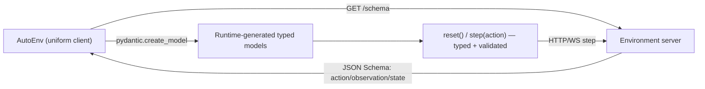

# RFC: Self-Describing Environments (Uniform Client, No Per-Env Install)

**Status**: Draft
**Created**: 2026-07-06
**Authors**: @adithya-s-k
**RFC ID**: TBD (draft — number to be assigned)

## Summary

Today, using an OpenEnv environment with type safety requires `pip install`ing a
per-environment client package. That package exists only to carry two things: the
Pydantic models (`Action` / `Observation` / `State`) and the serialization glue
(`_step_payload` / `_parse_result` / `_parse_state`). The environment's contract —
what an action looks like, what an observation contains — lives *nowhere on the
wire*; it lives inside shipped code.

This RFC proposes that environments **publish their own contract as JSON Schema
over the wire**, via a `/schema` endpoint and an optional `schema:` block in
`openenv.yaml`. A single uniform client (`AutoEnv`) fetches that schema at connect
time and **dynamically builds the typed Pydantic models at runtime** using
`pydantic.create_model`. The result: the ergonomics of the uniform, no-install
client, *with* boundary validation and typed access — you only lose static IDE
autocomplete, which remains available for authors who still ship a typed package.

This is deliberately modeled on the Open Reward Standard (ORS), which puts the
agent-environment contract on the wire so one client serves every environment. We
adopt that idea without giving up OpenEnv's typing or its support for non-LLM
(continuous / classical RL) action spaces.

## Motivation

### Problem Statement

Per RFC 001, the client and server are strictly separated: clients never import
from `server/`. The consequence is that every environment must ship a standalone
typed client package, and consumers must `pip install` one package per
environment they touch. For a training run that sweeps across dozens of
environments, that is dozens of installs whose only job is to describe data shapes.

Meanwhile:

- `openenv.yaml` carries *runtime* metadata only (name, port, app) — no contract.
- The `GenericEnvClient` escape hatch avoids installs but hands back untyped dicts,
  so validation and discoverability are lost.
- MCP tool environments already self-describe (via `tools/list` `inputSchema`), but
  step-based environments (Wordle, chess, gym-style) do not.

The contract knowledge does not disappear when you drop the typed client — it
moves into the caller's training script as hand-written dict access. This RFC
moves it onto the wire instead, where a uniform client can consume it.

### Goals

1. Let any environment be used with a **single uniform client**, no per-env install.
2. Preserve **boundary validation** and **typed access** without shipped code.
3. Make the environment contract **discoverable and versioned on the wire**.
4. Remain **fully backward compatible** with existing typed clients and manifests.
5. Support **non-LLM action spaces** (continuous, discrete, structured), unlike a
   tool-calling-only contract.

### Non-Goals

1. Not deprecating per-env typed clients — they remain the way to get static IDE
   autocomplete and hand-tuned serialization.
2. Not a new transport — this rides existing HTTP/WebSocket + MCP.
3. Not a reward/task specification — that is RFC 004 (rubrics) and RFC 006
   (datasets). This RFC only standardizes the *data-shape* contract.

## Design

### Architecture Overview



The server already has the Pydantic models. Pydantic emits JSON Schema for free
(`Model.model_json_schema()`), so the environment can publish its contract with no
new author work. The uniform client fetches it once and reconstructs typed models
locally.

### The `/schema` Endpoint

Every environment server exposes a read-only endpoint returning its contract:

```http
GET /schema
```

```json
{
  "spec_version": "openenv-schema-0.1",
  "env_id": "wordle_env",
  "version": "0.1.0",
  "action": {
    "type": "object",
    "title": "WordleAction",
    "properties": {
      "guess": { "type": "string", "minLength": 5, "maxLength": 5 }
    },
    "required": ["guess"]
  },
  "observation": {
    "type": "object",
    "title": "WordleObservation",
    "properties": {
      "feedback": {
        "type": "array",
        "items": { "type": "string", "enum": ["hit", "present", "miss"] }
      },
      "guesses_remaining": { "type": "integer" },
      "reward": { "type": ["number", "null"] },
      "done": { "type": "boolean" }
    },
    "required": ["feedback", "guesses_remaining", "done"]
  },
  "state": {
    "type": "object",
    "title": "WordleState",
    "properties": {
      "episode_id": { "type": ["string", "null"] },
      "step_count": { "type": "integer" }
    }
  }
}
```

For MCP tool-based environments, `action` MAY instead reference the tool surface,
signalling the client to drive actions via `tools/list` / `tools/call` rather than
a single action object:

```json
{
  "spec_version": "openenv-schema-0.1",
  "env_id": "coding_env",
  "action": { "$mcp": "tools" }
}
```

### The `schema:` Block in `openenv.yaml` (optional)

Static hosts (or clients that want the contract *before* the server is running,
e.g. for reference-based resolution) may inline or point to the schema:

```yaml
spec_version: 1
name: wordle_env
type: space
runtime: fastapi
app: server.app:app
port: 8000

# NEW — optional; when absent, clients fall back to GET /schema at runtime
schema:
  source: endpoint          # "endpoint" (default) | "inline" | "file"
  file: schema.json         # used when source == "file"
```

When `schema:` is absent entirely, behavior is unchanged from today — the client
either uses a shipped typed package or `GET /schema` if the server supports it.

### Server-Side: Zero Extra Author Work

The base server derives and serves the schema from the environment's declared
models. Authors write nothing new:

```python
# openenv/core/env_server/http_server.py (framework code, illustrative)
@app.get("/schema")
def get_schema() -> dict:
    return {
        "spec_version": "openenv-schema-0.1",
        "env_id": env.id,
        "version": env.version,
        "action": ActionModel.model_json_schema(),
        "observation": ObservationModel.model_json_schema(),
        "state": StateModel.model_json_schema(),
    }
```

### Client-Side: Runtime-Generated Typed Models

`AutoEnv` fetches the schema and builds Pydantic models on the fly. This is the
crux of the "typed without install" claim:

```python
from openenv import AutoEnv

# No wordle_env package installed anywhere.
env = AutoEnv.from_env("http://localhost:8000")

result = env.reset()
print(result.observation.guesses_remaining)   # typed attribute access, 6
print(result.observation.feedback)            # ["miss", "present", ...]

# Validated at the boundary: wrong shape fails loudly, with a clear error.
result = env.step({"guess": "crane"})          # dict is validated against schema
# env.step({"guesss": "crane"})  -> ValidationError: unexpected field 'guesss'
```

Under the hood, `AutoEnv` reconstructs the model from the JSON Schema:

```python
# openenv/auto/auto_env.py (illustrative)
from pydantic import create_model
from typing import Optional

def _model_from_schema(name: str, schema: dict) -> type:
    fields = {}
    required = set(schema.get("required", []))
    for prop, spec in schema.get("properties", {}).items():
        py_type = _json_type_to_python(spec)           # str, int, list[str], ...
        default = ... if prop in required else None
        annotated = py_type if prop in required else Optional[py_type]
        fields[prop] = (annotated, default)
    return create_model(name, **fields)                # a real Pydantic model

WordleAction = _model_from_schema("WordleAction", schema["action"])
WordleObservation = _model_from_schema("WordleObservation", schema["observation"])
```

The generated models plug into the existing generic `EnvClient[ActT, ObsT, StateT]`
machinery — `_step_payload` becomes `action.model_dump()`, `_parse_result` becomes
`ObservationModel.model_validate(payload)`. No per-env serialization glue needed.

### Worked Example: Wordle, Three Ways

The same running Wordle server, consumed three ways — all interoperable:

```python
# 1. Uniform client, no install, typed via /schema  (this RFC)
env = AutoEnv.from_env("http://localhost:8000")
obs = env.reset().observation
obs.feedback                       # typed, validated

# 2. Uniform client, no install, untyped  (exists today)
env = GenericEnvClient(base_url="http://localhost:8000")
env.step({"guess": "crane"})["observation"]["feedback"]   # raw dicts

# 3. Typed package, pip installed  (exists today; best IDE autocomplete)
from wordle_env import WordleEnv, WordleAction
env = WordleEnv(base_url="http://localhost:8000")
env.step(WordleAction(guess="crane")).observation.feedback
```

### Comparison to ORS (why this design)

| Concern | ORS / OpenReward | This RFC |
|---|---|---|
| Contract location | On the wire (MCP + RL primitives) | On the wire (`/schema` + MCP) |
| Client | One uniform tool-calling client | One uniform client (`AutoEnv`) |
| Per-env install | None | None (typed package optional) |
| Non-LLM action spaces | Tool-calling only | Any JSON-Schema-describable action |
| Typing | Implicit via tool schemas | Explicit runtime-generated models |

ORS demonstrates that putting the contract on the wire is what enables a uniform
client. This RFC adopts that lesson while keeping OpenEnv's ability to describe
continuous/structured actions (`carla_env`, `dm_control_env`) that a
tool-calling-only surface cannot express.

## Key Design Decisions

- **Contract on the wire, derived from existing models.** No new author burden;
  `model_json_schema()` already produces it.
- **Runtime-generated typed models.** Uniform client + validation + typing, at the
  cost of static IDE autocomplete only.
- **Backward compatible and additive.** Absent `/schema` and `schema:` → today's
  behavior. Typed packages keep working and take precedence when installed.
- **MCP reuse.** Tool-based envs point `action` at their MCP tool surface rather
  than duplicating schemas — one mechanism, two shapes.
- **Composable with RFC 006.** The datasets `environment.yaml` can carry or link
  the `/schema` output so reference-based resolution (`hf://datasets/...`) yields a
  typed, no-install client with tasks attached.

## Examples

Reference-based, dataset-bound, typed, zero install (this RFC + RFC 006):

```python
from openenv import AutoEnv

env = AutoEnv.from_env(
    "hf://datasets/openenv/wordle-tasksets/wordle@main",
    split="train",
)
obs = env.reset().observation      # typed via fetched /schema
env.dataset                        # tasks attached via RFC 006 row cursor
env.step({"guess": "crane"})       # validated against wire schema
```

## Implementation Plan

### Phase 1: Server `/schema` endpoint
- Add `GET /schema` to the base FastAPI server; derive from declared models.
- No changes required in existing environments — they inherit it.

### Phase 2: `AutoEnv` runtime model generation
- JSON-Schema → Pydantic model builder (`_model_from_schema`).
- Wire generated models into the generic `EnvClient` step/parse path.

### Phase 3: `openenv.yaml` `schema:` block + validation
- Optional static declaration for pre-runtime resolution.
- CLI validation (`openenv validate`) checks schema round-trips.

### Phase 4: RFC 006 integration
- Carry/link `/schema` output in dataset `environment.yaml`.

## Open Questions

1. **Schema drift.** If a running server's `/schema` disagrees with a shipped typed
   package version, which wins, and how loudly do we warn?
2. **JSON Schema coverage.** How much of JSON Schema (`$ref`, `oneOf`, nested
   models, enums) must the runtime builder support in v1? Reuse the normalization
   already in `llm_client._clean_mcp_schema`?
3. **Continuous action spaces.** Do we standardize a numeric-array convention
   (bounds, dtype, shape) for `carla_env` / `dm_control_env`, or defer to a
   follow-up RFC?
4. **Caching.** Should `AutoEnv` cache generated models per `(env_id, version)` to
   avoid rebuilding on every connect?
